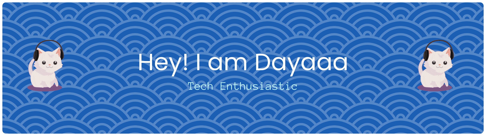
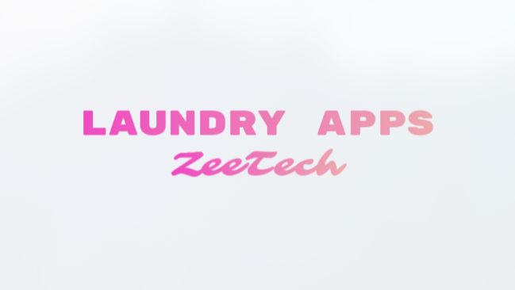

<!-- Banner Section: Replace this with your own banner image URL or remove if not needed -->
<p align="center">
  
</p>

<h1 align="center">
   
  Hi, I’m <span style="color:#00ADD8;">Muhammad Amin Hidayat</span>!
</h1>

<p align="center">
  <b>Web Developer | Tech Enthusiast | Networking Buff | Student @ Universitas Dipa Makassar</b>
  <br>
  <i>Building apps, connecting worlds, and chasing sunsets 🌅</i>
</p>

<p align="center">
  <!-- Social Media Badges -->
  <a href="https://instagram.com/ur.dayaa" target="_blank">
    
  </a>
  <a href="https://www.linkedin.com/in/muhammad-amin-hidayat/" target="_blank">
    
  </a>
  <a href="https://g.dev/hidayatdev" target="_blank">
    
  </a>
</p>

---

## 🧑‍💻 About Me

- 📡 A passionate web developer who loves to tinker with code and networks.
- 🎓 Proudly learning and growing at Universitas Dipa Makassar.
- 🧩 Always seeking the next puzzle to solve—especially with Python, C++, JS, PHP, and Go!
- 🌍 Connecting communities through technology and collaboration.

---

## 🚀 Tech Toolbox

<p align="center">
  
  
  
  
  
  
</p>

---

## 🌟 Featured Projects

<table align="center">
  <tr>
    <td align="center" width="50%">
      <a href="https://github.com/zeetechnologia/Laundry_Apps">
        <br/>
        <b>Laundry_Apps</b>
      </a>
      <br>
      <i>Modern laundry management system for real-world business needs.</i>
    </td>
    <td align="center" width="50%">
      <a href="https://github.com/dcc-dp/sifo-desa">
        <br/>
        <b>Dipanegara Computer Club Business Website</b>
      </a>
      <br>
      <i>Empowering student communities with web solutions.</i>
    </td>
  </tr>
  <tr>
    <td align="center" width="50%">
      <a href="https://github.com/dayattt111/QR-code">
        <br/>
        <b>QR Code Generator</b>
      </a>
      <br>
      <i>Starter for Gin (Go) web apps—containerized and ready to scale.</i>
    </td>
    <td align="center" width="50%">
      <a href="https://github.com/dayattt111/book-shell-udemy">
        <br/>
        <b>book-shell-udemy</b>
      </a>
      <br>
      <i>Shell scripting exercises & notes from my learning journey.</i>
    </td>
  </tr>
</table>

---

## 🌅 Fun Fact

> When I’m not coding or configuring networks, you’ll find me at the beach, chasing sunsets and fresh inspiration!  
> 

---

<p align="center" style="font-size:14px;">
  <i>Thanks for stopping by! Let's build something amazing together 🚀</i>
</p>


```json
{
  "name": "Muhammad Amin Hidayat",
  "alias": "Dayat",
  "role": "Web Developer",
  "university": "Universitas Dipa Makassar",
  "interests": [
    "Web Development",
    "Networking",
    "Automation",
    "Linux",
    "Cybersecurity"
  ],
  "stack": {
    "frontend": ["HTML", "CSS", "JavaScript"],
    "backend": ["PHP", "Go", "Python"],
    "tools": ["Git", "Linux", "Docker"]
  },
  "currently_learning": ["Go", "Network Engineering", "Web Security"],
  "status": "Always building things 🚀"
}

