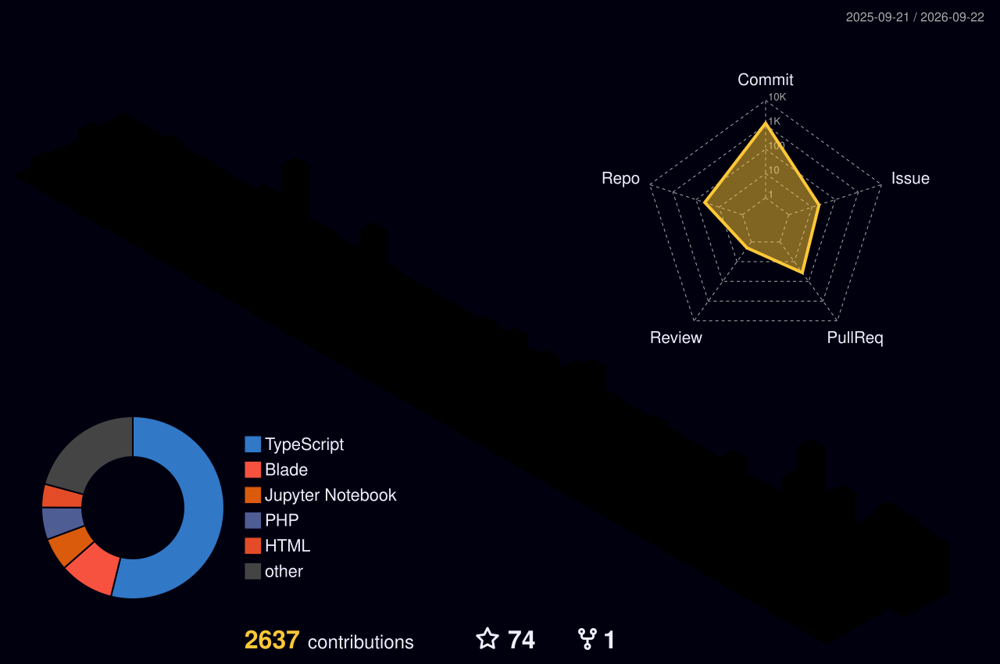

  <!-- 1. Header / Typing Intro -->
  

   

  <!-- 2. Licenses & Featured Certifications -->
  

    
  

   

  <!-- 3. Google Developer Badges (1 Baris Rata Tengah) -->
  

    
    &nbsp;
    
    &nbsp;
    
    &nbsp;
    
    &nbsp;
    
    &nbsp;
    
    &nbsp;
    
    &nbsp;
    
  

   

  <!-- 4. Support & Sponsor Button (Footer) -->
  

    
  

### Humor Receh Mas-Mas Palugada yang tiap hari di ruang Server :
<!-- JOKE:START -->
> *"Why did the JavaScript heap close shop?  It ran out of memory."*
<!-- JOKE:END -->

---

<strong>Explore My Profile ( Click )</strong>

 

  

### About

# Muhammad Amin Hidayat (Indonesia)
## **Timika, Papua(Now) - Makassar, South Sulawesi**
Technology has always been more than just writing code for me—it is a medium to transform ideas into products that solve real problems.

My journey began in backend development and gradually expanded into full-stack engineering, artificial intelligence, automation, cloud computing, Linux systems, and networking. Today, my primary focus is on engineering software that is functional, scalable, maintainable, and deeply meaningful for its users.

Driven by curiosity and continuous improvement, I treat every project as an opportunity to learn, experiment, and build something better than before. I am always open to collaborating on innovative tech projects and connecting with fellow builders.

---

  

  <b>Artificial Intelligence</b>
  &nbsp;&nbsp;•&nbsp;&nbsp;
  <b>FullStack Dev</b>
  &nbsp;&nbsp;•&nbsp;&nbsp;
  <b>Automation</b>

"Actively leading and contributing to tech communities, empowering students and developers through mentorship, collaboration, and knowledge sharing."

<table width="100%">
  <tr>
    <td width="25%" align="center">
      
    </td>
    <td width="25%" align="center">
      
    </td>
    <td width="25%" align="center">
      
    </td>
    <td width="25%" align="center">
      
    </td>
  </tr>
</table>

### Tech Stack

---

### Streak Woy Streak

  

---

### Contribution Activity

  

### 3D Contribution Graph

  

### In-Depth Metrics

  

---

### Activity

### Free Resources

Laragon

https://drive.google.com/drive/folders/1xCyjzhMblHocIRZkHjer9CWDVnFo_Ek7

